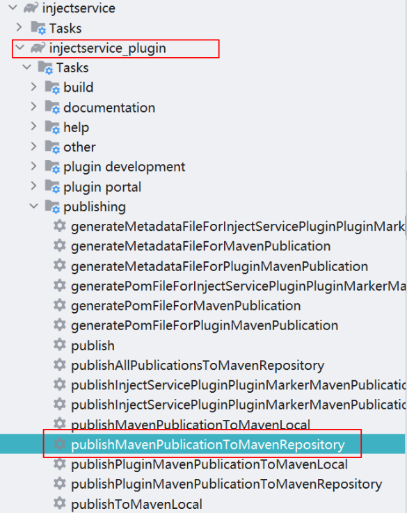
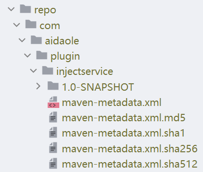

[](https://jitpack.io/#aidaole/InjectService)

## 1. 介绍项目结构

```
app
  |
  +-modules         // 业务层
  |   |
  |   +- module1    // 业务模块1
  |   |
  |   +- module2    // 业务模块2
  |
  +-injectservice
  |   |
  |   +-injectservice_plugin  // 插件实现
  |   |
  |   +-injectservice_runtime // 插件runtime
  |  
  +-base
      |
      +-lib_interface         // 定义接口 
```
主要功能就是 `module2` 不通过依赖 `module1` 来实现访问 `mdoule1` 的接口实现，模块间交互的接口都放在 `lib_interface` 中

## 2. 使用方法

### 2.1 编译发布插件

首先到 [InjectService](https://github.com/aidaole/InjectService) clone下来代码 `sync` 项目通过

然后找到发布插件的 gradle task: `publishMavenPublicationToMavenRepository` 发布插件



然后在 `project` 的 `repo` 文件夹下可以找到插件



### 2.2 引用插件

#### 2.2.1 本地发布

`settings.gradle` 添加

```gradle
pluginManagement {
    repositories {
        // ...
        maven { url './repo' }
    }
}`
```

project的 `build.gradle` 添加

```gradle
buildscript {
    dependencies {
        classpath "com.aidaole.plugin:injectservice:1.0-SNAPSHOT"
    }
}
```

app 的 `build.gradle` 应用插件

```gradle
plugins {
    // ...
    id 'com.aidaole.injectservice'
}
```

#### 2.2.2 依赖jitpack版本

添加jitpack依赖

```groovy
maven { url 'https://jitpack.io' }
```

project的build.gralde中依赖插件版本

```groovy
buildscript {
    dependencies {
        classpath "com.github.aidaole:InjectService:0.0.4"
    }
}
```

app的build.gradle中应用插件

```groovy
plugins {
    // ...
    id 'com.aidaole.injectservice'
}
```

### 2.3 使用插件注入

`base` 层 `lib_interface` ，创建接口类。 不依赖任何库

```kotlin
interface DialogInterface { // module1 接口

    fun dialog(): String
}
```

```kotlin
public interface WindowInterface { // module2 接口

    String hello();
}

```

业务层中, `:module1` 定义实现类，并添加注解实现的是`DialogInterface`接口；
`:module2` 定义实现类, 并添加实现类注解 `WindowInterface`

```kotlin
@InjectService(DialogInterface::class)
class DialogInterfaceImpl : DialogInterface {
    override fun dialog(): String {
        return "inject dialog"
    }
}
```

```kotlin
@InjectService(WindowInterface::class)
class WindowInterfaceImpl : WindowInterface {
    override fun hello(): String {
        val dialog = InjectManager.get(DialogInterface::class.java)
        return "hello " + dialog.dialog()
    }
}
```

`:module1`，`:module2` 不项目依赖，但是都要依赖底层接口和runtime

```gradle
dependencies {
    // ...
    implementation project(":base:lib_interface")
    implementation project(":injectservice:injectservice_runtime")
}
```

app 层初始化和调用

```kotlin
class MyApplication : Application() {

    override fun attachBaseContext(base: Context?) {
        super.attachBaseContext(base)
        InjectManager.init() // 初始化注入管理器
    }
}
```

```kotlin
class MainActivity : AppCompatActivity() {
    override fun onCreate(savedInstanceState: Bundle?) {
        super.onCreate(savedInstanceState)
        setContentView(R.layout.activity_main)
        // 获取并调用接口
        val windowImpl = InjectManager.get(WindowInterface::class.java)
        findViewById<TextView>(R.id.test_text).text = windowImpl.hello()
    }
}
```